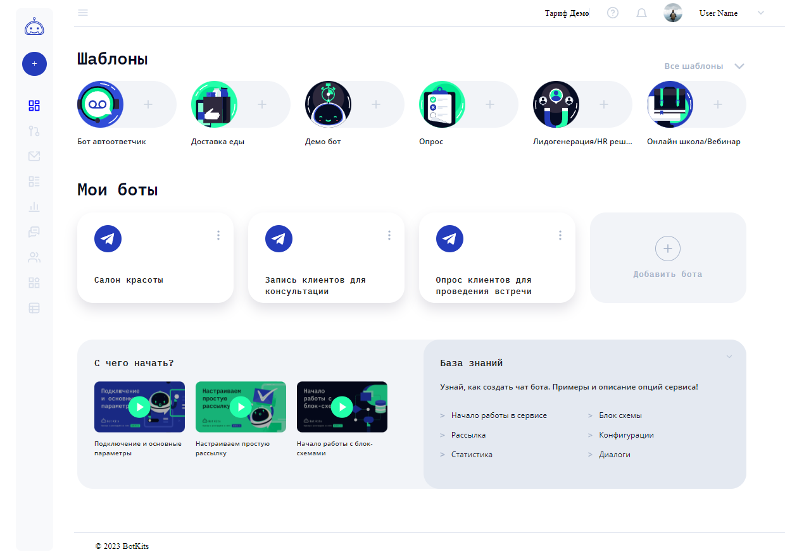

# Bot-kit

## 🌍 Ссылки

* [Bot-kit](https://bot-kits-mqyd4sd1b-andrey-grishkov.vercel.app/) - сайт на хостинге Vercel;
* [Brief](https://www.notion.so/BotKits-11-2f6ea7e8409349108278d17f475fa9bb) - бриф проекта;
* [Figma](https://www.figma.com/file/89caTZSLaLwqYKSWH4SXLo/BOTkit-Admin-panel-(Copy-07.08.23)?type=design&node-id=26-24906&mode=design&t=N3Tqq2EV1KVl9sUW-0) - макет проекта;
* [Сайт заказчика](https://botkits.ru/) - текущий сайт заказчика;

---

## 🤖 О проекте Bot-kit
__Bot-kit__ — сайт сервиса по созданию ботов для мессенджеров и социальных сетей.
Создать бота можно по одному из стандартных шаблонов (бот-автоответчик, доставка еды, 
онлайн-покупки и т.д.) или сделать бота самому в конструкторе ботов, где создается сценарий работы бота с 
помощью блок-схемы. Также сервис предоставляет возможности подключить бота к мессенжеру или социальной сети,
настроить рассылки сообщений в чат ботах, позволяет просмотреть все диалоги с пользователями в чат-ботах,
посмотреть статистику, выбрать тарифный план, настроить общий доступ и т.д.
Подробнее о возможностях проекта можно процитать на сайте заказчика во вкладке "База знаний".

_Главная страница_

---

## 🍪 Работа над проектом

__Bot-kit__ — коммерческий проект, который заменит текущий сайт заказчика по его завершению.
Проект будет полностью создан студентами Яндекс Практикума, обучающихся по программе "Веб-разработчик+". 
Реализация разбита на 3 части, каждую часть будут выполнять студенты выпускной когорты в качестве 
дипломной работы. Когорта делиться на команды, и в соревновательном режиме каждая команда в своем 
репозитории ведет работу над проектом. По окончанию выделенного времени на выполнение работы, наставник 
отбирает лучшую работу, которая передаются следующей кагорте для следующего этапа доработок.
Таким образом над созданием проекта поработают три выпускных когорты Яндекс Практикума.    
Представленная работа  - это первая итерация работы на проектом, которая заняла почетное 2-е место 🏆.
Работа дает возможность продемонстрировать студентам ранее полученные навыки разработки, укрепить софт скилы, 
работая в команде в режиме ограниченного времени и конкуренции (за курс студенты учавствуют в 3-х командных проектах).
Для руководства каждой команды назначается тимлидер из наиболее активного активного участника команды или 
приглашенный выпускник Яндекс Практикума. Для выполнения текущей работы был приглашен старший студент, выпускник 45-го
потока курса "Веб-разработчик". Тимлидер организовывает команду, структурирует проект, распределяет задачи между 
участниками, в зависимости от их возможностей, ведет Kanban-доску, устраивает созвоны, консультирует по всем 
техническим вопросам, проводит ревью пулл реквестов участников, проводит слияния веток и решает конфликты, 
поддерживает в команде мотивацию и доверительные отношения🤗.   
Связь между тимлидами команд, заказчиком и опытным наставником координировал project-manager выпускник курса "Менеджер Проектов" Яндекс Практикума. 

---

## 💪 Команда проекта

__Наставник__: [Алексей Мартынов](https://github.com/FenixDeveloper) 🎅    
__Project Manager__: [Ильзира Сабитова](https://github.com/IlziraSabitova) 💼    
__Team Leader__: [Андрей Гришков](https://github.com/Andrey-Grishkov) 👑    

### Команда разработчиков
[Никита Перепелицын](https://github.com/trashmarket) 🙂   
[Игорь Степанов](https://github.com/randomu3) 😉    
[Елизавета Юновидова](https://github.com/lizonkisel) 😊    
[Артём Башакин](https://github.com/Tema-Bash) 😇    
[Данила Ильин](https://github.com/Daniel-il) 😌    
[Константин Шереметов](https://github.com/Konstantin0099) 😀    
[Руслан Кулиш](https://github.com/happy-land) 😋    
[Елизавета Циприс](https://github.com/Dumisel) 😎️    

---

## 🛠️ Cтек технологий
HTML, SASS, GitHub, TypeScript, React, Redux, Story Book

    

    

---

## 💡 Реализованные части проекта

* _UI kit_ сделан на 70% (не выполнены элементы конструктора). Большая часть элементов выполнена в сторибуке. 
  Для участников, которым сложно пользоваться стори буком, создана страница по линку '/ui', 
  где эти элементы можно наглядно посмотреть.
* _Аутентификация_ - регистрация, авторизация и смена пароля доступны по линкам: '/signup', '/signin' и
  '/reset-password' соответственно. При сабмите форм регистрации и смены пароля появляются попапы 
  уведомления. Присутствует валидация полей формы. На странице "Регистраиция" выполнено выпадающее меню со 
  списком стран и кодами телефонных номеров. На данном этапе работы над проектом не подразумевалось 
  использовать серверную часть.
* _Sidebar_ - боковое меню, а также элементы header и footer. Меню выезжает при нажатии на бургер меню в
  header. Все кнопки меню осуществляют редирект на нужную страницу. По нажатию на логотип редирект на главную страницу.
* _Dasboard_ - главная страница доступна по линку '/'. Реализовано выпадающее меню при нажатии на 
  "Все шаблоны". При нажатии на шаблон появляется попап. 
  Если в кнопках мои боты нажать на три точки, то появляется выпадающее меню, по нажатию на пункты меню появляются попапы. 
  Внизу страницы блок с видео, при нажатии - открывается попап с видео. Справа-снизу рабочие линки на базу знаний 
  на сайте заказчика.
* _Add Bot_ - страничка добавления бота доступна по линку '/addbot'. По нажатию на кнопку социальной сети или 
  мессенжера появляется форма создания бота. Для Facebook есть возможность добавлять страницы на которых будет
  работать бот.
* _Bot Builder_ - конструктор ботов доступен по линку '/botbuilder'. В рамках первого этапа работы над проектом,
  создание конструктора не предусмотрено.
* _Subscription and payments_ - страница с подписками и платежами доступна по линку '/subscription_and_payments'. 
Проведена имитация работы с апи - страница отрисовывается по массиву входящих данных. В блоке с историей 
  платежей при нажатии на галочку можно применить фильтр по типу операции.
* _Chat_ - страничка чата доступна по линку '/chat'. Страничка сверстана статично с имитацией приходящих с апи данных.
* _Partnership Program_ - страница с партнерской программой доступна по линку '/partnership'. 
  Реализована функция копирования ссылки и сохранения ее в память браузера. Реализована имитация данных с сервера путем 
  создания массива данных по которому рендерится страница. Можно свернуть и развернуть блок с выплатами.
* *_Mailing_* - страница рассылок доступна по линку '/mailing'. Создана также иммитация получения данных с апи.
Сворачивается и разворачивается блок с моими рассылками. По нажатию на кнопку "создать рассылку" появляется форма.
Работают выпадающие списки, сворачивается и разворачивается текстовый виджет, в текстовом виджете 
дублируется текст, который вводиться в textarea, доступна вставка смайликов из выпадающего меню. 
Реализована функция загрузки видео, аудио, изображения а также добавления кнопки по нажатию на 
соответствующую кнопку.
---

## 📅 Планы по улучшению работы
* Реализовать не доделанный функционал
* Доработать адаптивную верстку
* Провести тщательный рефакторинг по изменению структуры, оптимизации и стандартизации кода, 
  провести проверку линтером и устранить ошибки, удалить ненужные и задублированные фаилы
